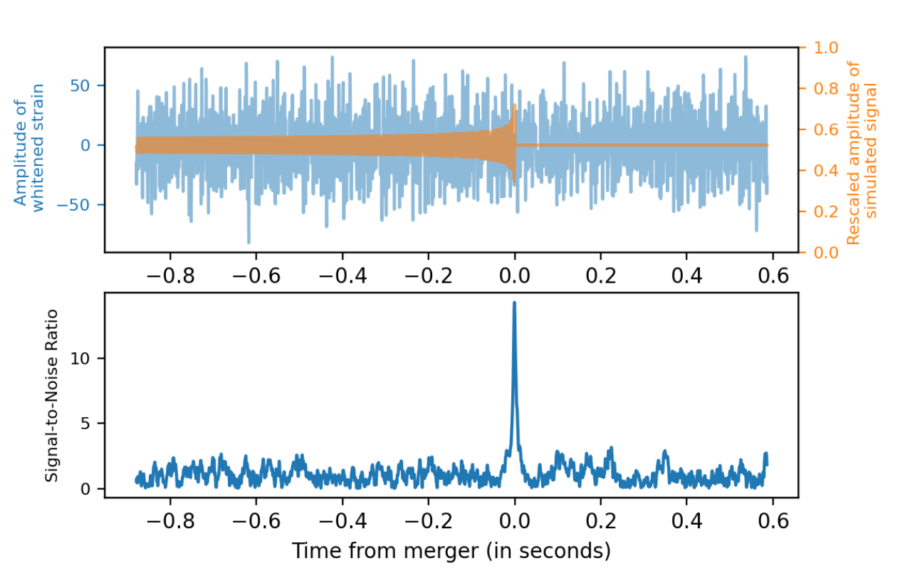

In 2015, a new era in astronomy began with the first detection of gravitational waves from a pair of merging black holes located more than 1.3 billion light years away. Since then, the LIGO Virgo KAGRA (LVK) Collaboration has detected 90 gravitational wave events from mergers of compact binaries. These include signals from binary black hole, binary neutron star and neutron star-black hole mergers - known together as compact binary coalescences (CBC). 

The detection of gravitational waves from CBC sources with a neutron star component is particularly exciting for astronomers worldwide. This is because within ~2 seconds of their merger, electromagnetic transients in various wavelengths are emitted - something we do not typically expect from binary black hole systems. These transients range from short energetic bursts immediately following the merger, like the short gamma-ray burst, to kilonovas and optical afterglows, which can be observed for several days or months after the event. 
|  | 
|:--:| 
| *Electromagnetic counterparts of binary neutron star mergers (Courtesy: Dr. Qi Chu)* |

The detection of gravitational waves and the corresponding short gamma ray burst from a binary neutron star merger in 2017 (known as GW170817) was the first multi-messenger observation involving both gravitational and electromagnetic waves. This detection, made possible by the joint effort of the LIGO-Virgo detectors, and the FERMI-GBM and INTEGRAL space telescopes, has opened the doors for probing neutron star physics, cosmology and high energy astrophysics.

While more multi-messenger observations like GW170817 are certainly desirable, there is one major roadblock to achieving it. These short gamma-ray bursts last for only 1 second after the merger of the binary neutron star. In order to detect them, electromagnetic telescopes need to be told where to look for them in the sky, in less than a second. However, algorithms used by the LVK Collaboration for sky localization have a wide range of latencies - from ~ 10 secs for the localization software BAYESTAR, to anywhere between 6 hours and 6 days for full 15 dimensional parameter estimation codes like LALInference and Bilby. We therefore need faster techniques that can predict the probability distribution of the sky direction in less than a second. This is where deep learning steps in!

Deep learning models are designed to mimic the functioning of neurons in our brain. This is done by making algorithms called ‘neural networks’ learn correlations between a labeled input dataset and the output it is trying to predict. To get the best performance out of these networks, they need to be ‘trained’, or in other words, their parameters need to be optimized to minimize errors between their predictions and the labels (ground truths). Several deep learning models have been developed in the last few years for the detection, classification and parameter estimation of binary black hole gravitational wave events. However, there are no published results (at the time of writing) for deep learning-based parameter estimation of binary neutron star and neutron star-black hole binaries - sources with potential electromagnetic counterparts.

To address this, we have designed ‘CBC-SkyNet’ or Compact Binary Coalescence Sky Localization Neural Network - the first deep learning model for sky localization of all CBC sources. CBC-SkyNet achieves comparable localization accuracy to traditional techniques at orders of magnitude faster speeds of a few milli-seconds! This can potentially enable rapid follow-up observations as soon as a gravitational wave detection is triggered. What makes our approach unique is that instead of using simulated gravitational wave signals to train our model, which can be > 100 secs long depending on the source, we use just 0.2 sec long signal-to-noise ratio (SNR) time series data for training. The SNR time series is generated by cross-correlating the raw gravitational wave detector data with millions of template signals that span a range of component mases and spins. This cross-correlation operation is used to search for gravitational wave signals in noisy detector data, and is called ‘matched filtering’. Wherever the detector data and template match exactly, we get a sharp peak in the SNR time series output. 

|  | 
|:--:| 
| *Bottom panel: SNR time series corresponding to the gravitational wave signal above. Top panel: The gravitational wave detector data containing a signal (blue). The signal embedded in the data (orange).* |

Since training neural networks on short signals is easier (requires much less computational resources), we were able to obtain highly accurate sky localization of all CBC sources using a relatively simple network architecture.

CBC-Skynet consists of three neural networks - two identical Residual Neural Networks (ResNet) that learns features from real and imaginary parts of the complex SNR time series, and a Masked Autoregressive Flow (MAF) model, which produces the sky direction probability distribution, conditioned on features extracted by the ResNets .
 
The MAF belongs to a class of deep generative models called ‘normalizing flows’. These models can transform a simple base distribution into arbitrarily complex distributions almost instantly, and have gained a lot of popularity in recent years (For a more detained discussion on normalizing flows, check [Ref]). Our MAF implementation transforms a Gaussian distribution, into the desired sky direction distribution, given the SNR time series data. The parameters of this transformation are determined by the neural network during the training step.

To test CBC-SkyNet’s performance, we have calculated the areas of the 90% credible regions of our model’s predicted sky distribution for each event. The 90% credible interval refers to the range of values or sky coordinates within which the probability of having the true coordinate is 90%. The bigger the areas of the 90% credible intervals, the larger is the model’s uncertainty in predicting the true sky direction. We find that for all CBC sources, our model’s 90% credible interval areas (when all three detectors are in operation) are less than 300 sq. degrees, which is consistent with LALInference/Bilby analyses (see Figure 5 in paper). However, we are able to obtain our predictions in milli-seconds, which is the main advantage of our approach. We have also tested CBC-SkyNet’s localization performance on a simulated GW170817-like event at the improved design sensitivity of LIGO and Virgo. We find that our model is able to accurately localize the event within the 50% credible interval in a few milli-seconds (Figure 4).

We plan to test our model’s performance on detector sensitivity of the fourth observation run (O4). This will give us an idea about our network’s capability to accurately localize events expected to be detected in the next science run. In the future, we also plan to use this approach for prediction of other important gravitational wave parameters like the masses and distance of the sources.

For details of the theory and model implementation, please check paper: https://arxiv.org/abs/2207.14522

