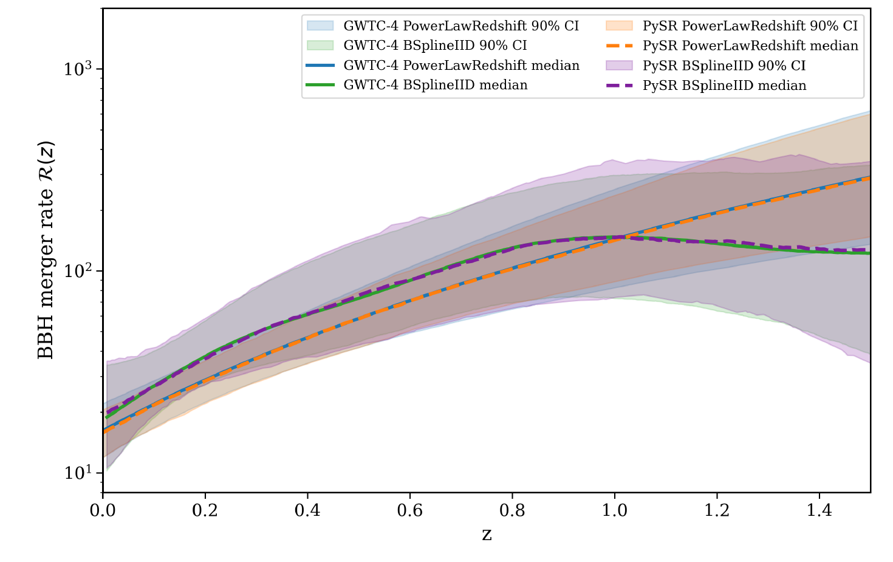

This project develops interpretable analytic summaries of binary black hole population properties inferred from the GWTC-4 catalog. Instead of treating flexible population models as opaque numerical objects, symbolic regression is used to learn closed-form surrogate expressions for merger-rate evolution, spin-population trends and mass-ratio structure near the primary-mass peaks.

The resulting formulae make it possible to inspect gradients exactly, compare features across model families and pass compact population summaries into downstream calculations such as rate forecasting, formation-channel comparisons and stochastic-background estimates.

|  |
|:--:|
| *Fig. 1: Symbolic-regression surrogates reproduce GWTC-4 binary black hole merger-rate trends while preserving posterior uncertainty across model families.* |

Related papers:
1. [Chayan Chatterjee 2026, ApJ](https://iopscience.iop.org/article/10.3847/1538-4357/ae88f4)
