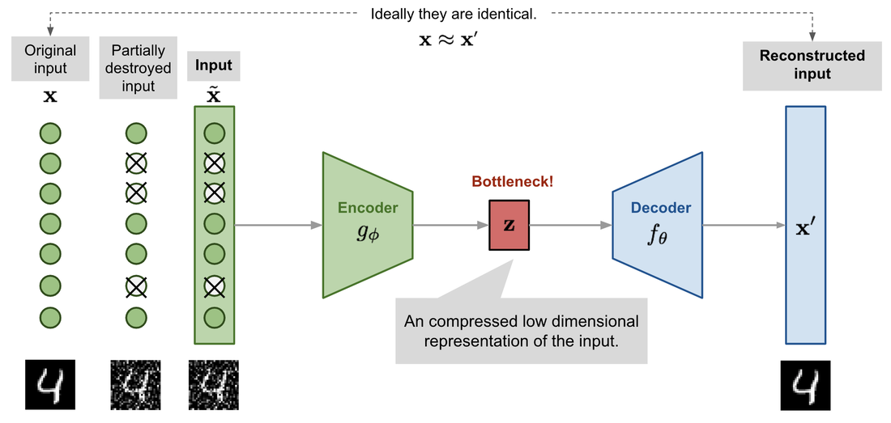
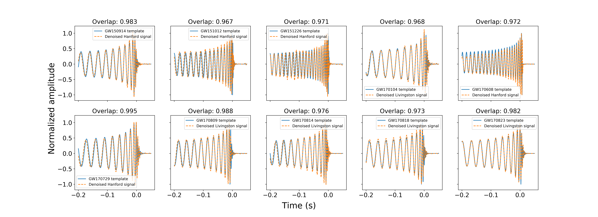

One of the major challenges involved in gravitational wave data analysis is accurately predicting properties of the progenitor black hole and neutron star systems from data recorded by LIGO and Virgo. The faint gravitational wave signals are obscured against the instrumental and terrestrial noise.    
 
LIGO and Virgo use data analysis techniques that aim to minimise this noise with software that can ‘gate’ the data – removing parts of the data which are corrupted by sharp noise features, called ‘glitches’. They also use methods that extract the pure gravitational-wave signal from noise altogether. However, these techniques are usually slow and computationally intensive; they’re also potentially detrimental to multi-messenger astronomy efforts, since observation of electromagnetic counterparts of binary neutron star mergers—like short-gamma ray bursts—relies heavily on fast and accurate predictions of the sky direction and masses of the sources.
 
In our recent study, we’ve developed a deep learning model that can extract pure gravitational wave signals from detector data at faster speeds, with similar accuracy to the best conventional techniques. As opposed to traditional programming, which uses a set of instructions (or code) to perform, deep learning algorithms generate predictions by identifying patterns in data. These algorithms are realised by ‘neural networks’ – models inspired by the neurons in our brain and are ‘trained’ to generate almost accurate predictions on data almost instantly.     

The deep learning architecture we designed, called a ‘denoising autoencoder’, consists of two separate neural networks: the Encoder and the Decoder. The Encoder reduces the size of the noisy input signals and generates a compressed representation, encapsulating essential features of the pure signal. The Decoder ‘learns’ to reconstruct the pure signal from the compressed feature representation. A schematic diagram of a denoising autoencoder model is shown in Figure 1  *Fig 1: A denoising autoencoder consists of an encoder and decoder that takes corrupted input data and retrieves the original data from it.*
 
For the Encoder network, we’ve included a Convolutional Neural Network (CNN) which is widely used for image classification and computer vision tasks, so it’s efficient at extracting distinctive features from data. For the Decoder network, we used a Long Short-Term Memory (LSTM) network—it learns to make future predictions from past time-series data.
 
Our CNN-LSTM model architecture successfully extracts pure gravitational wave signals from detector data for all ten binary-black hole gravitational wave signals detected by LIGO-Virgo during the first and second observation runs (Figure 2). *Fig 2: The performance of our model on 10 real binary black hole events from LIGO's first and second observation run is shown. The overlaps indicate how closely the extracted waveforms match with the original signal templates, with overlap of 1 indicating exact match.* 

It’s the first deep learning-based model to obtain > 97% match between extracted signals and ‘ground truth’ signal ‘templates’ for all these detected events.  Proven to be much faster than current techniques, our model can accurately extract a single gravitational wave signal from noise in less than a milli-second (compared to a few seconds by other methods).

We are now using our CNN-LSTM model with other deep learning models to predict important gravitational wave source parameters, like the sky direction and ‘chirp mass’. We’re also working on generalising the model to accurately extract single signals from low-mass black hole binaries and neutron star binaries.    
 
Paper status: Published in [Physical Review D](https://journals.aps.org/prd/abstract/10.1103/PhysRevD.104.064046)
