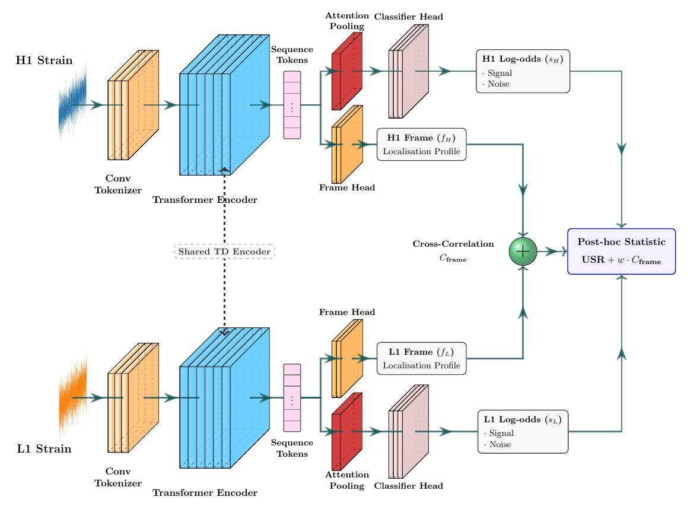

Castor, the Coincident Analysis Siamese TransfORmer, is designed for scalable binary black hole searches in Advanced LIGO data. Each detector stream is processed independently using shared transformer weights, and the resulting single-detector outputs are combined into a coincident statistic. This allows time-slide backgrounds to be generated from cached network outputs instead of rerunning the neural network for every slide.

|  |
|:--:|
| *Fig. 1: Castor tokenizes whitened H1 and L1 strain streams, processes them through shared transformer encoders, and combines single-detector log-odds and frame-localization profiles into a post-hoc coincident ranking statistic.* |
