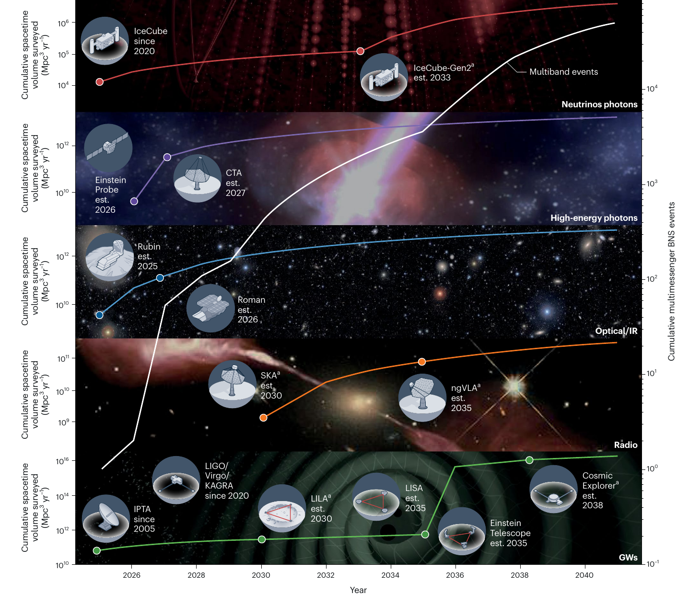

This Perspective grew out of the 2025 Vanderbilt workshop "Multimessenger Astronomy in the Era of Foundational AI" and frames multimessenger astronomy as a two-way opportunity: AI can help coordinate observations, accelerate inference and identify anomalies, while physically governed multimessenger data can help test whether frontier AI systems reason reliably about the natural world.

|  |
|:--:|
| *Fig. 2: MMA's data surge through 2041. The figure shows projected cumulative spacetime volume across messenger channels and the corresponding growth in observed binary neutron star multimessenger events.* |
